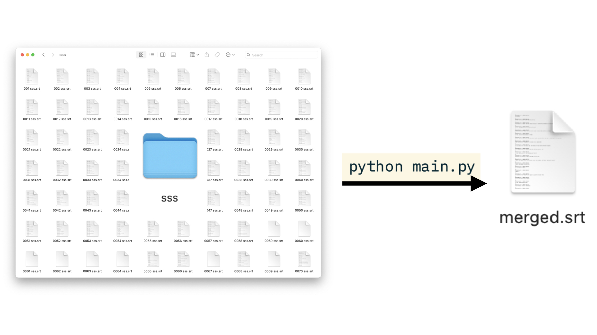

# srt-merger

[English README available here](README.md)

`SRT Merger` 是一个简单的 Python 脚本，用于按顺序合并多个 `.srt` 字幕文件。它根据文件名中的序号自动排序字幕文件，确保按正确的顺序合并并更新字幕的序号。



## 功能概述

- 自动按文件名中的序号（如 `001`, `002`, `003`）排序字幕文件。
- 合并所有 `.srt` 文件并保持时间戳和字幕内容。
- 更新字幕文件的序号，使其在合并后的文件中连续。

## 使用方法
1. 克隆仓库
   ```bash
   git clone https://github.com/your-username/srt-merger.git
   cd srt-merger
   ```

2. 准备你的 .srt 文件<br />将所有需要合并的 .srt 文件放在同一个文件夹中（例如 ./sss）。

3. 修改脚本中的文件夹路径<br />确保在脚本中将 folder_path 变量设置为包含你的 .srt 文件的文件夹路径。
   ```bash
   folder_path = "./sss"  # 修改为你的文件夹路径
   ```


4. 运行脚本<br />运行 Python 脚本，合并后的字幕文件将保存为 merged.srt。
   ```bash
   python main.py
   ```


5. 输出文件<br />合并后的字幕文件将保存在脚本所在目录下，文件名为 merged.srt。

## 安装要求
- Python 3.x
- 无需额外依赖库

## 贡献

欢迎提交 [issues](https://github.com/yzwbeast/srt-merger/issues) 或 pull requests，帮助改进项目！

## 许可证
本项目基于 MIT 许可证，详情请参阅 [LICENSE](LICENSE) 文件。

[English README available here](README.md)
